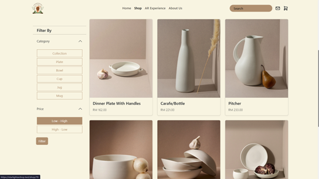
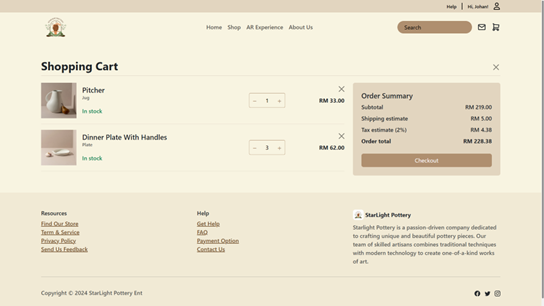
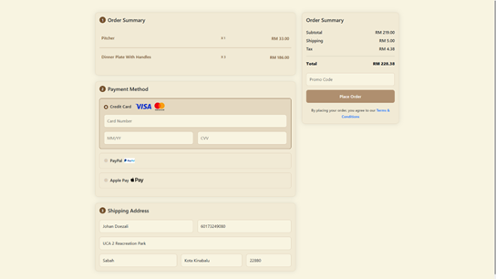
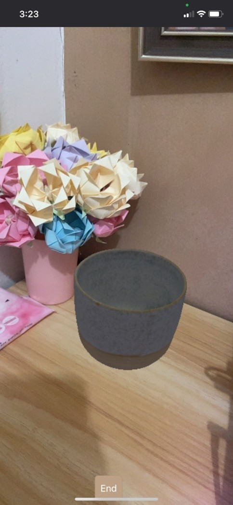

Starlight AR Shop - Final Year Project

🎓 About This Project

This is my Final Year Project, developed as part of my degree. I chose not to use any backend framework because I want to fully understand pure PHP, making it easier to adapt to new frameworks in the future.
Starlight AR Shop integrates a simple AR feature for specific products, allowing users to visualize them in real-world environments. At this stage, a payment gateway is not implemented yet, but the foundation is set for future enhancements.

🔧 Technologies Used

Frontend: [HTML, CSS, JS, Bootstrap]
Backend: [Pure PHP]
AR Framework: [WebXR, MindAR, Three.js]
Database: [MySQL]

📷 Example Screenshots

Shop Page

Cart Page

Checkout Page

AR Feature Page
